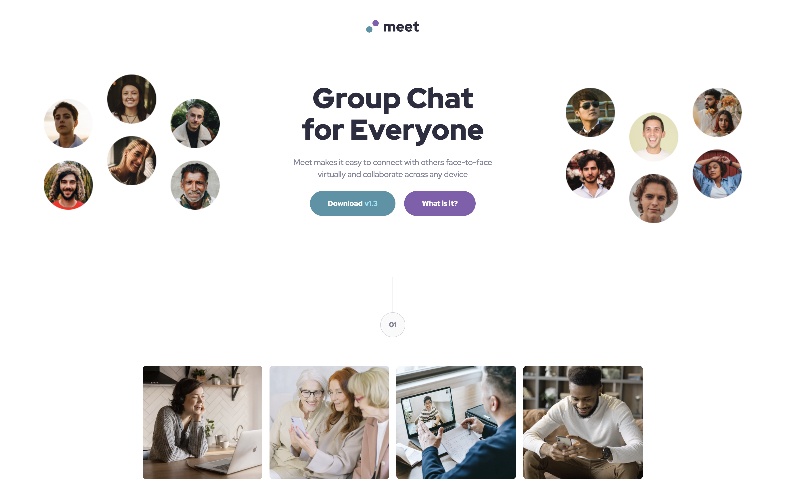

# Frontend Mentor - Meet landing page solution

## Table of contents

- [Overview](#overview)
  - [The challenge](#the-challenge)
  - [Screenshot](#screenshot)
  - [Links](#links)
- [My process](#my-process)
  - [Built with](#built-with)
  - [What I learned](#what-i-learned)
  - [Continued development](#continued-development)

## Overview

### The challenge

Users should be able to:

- View the optimal layout depending on their device's screen size
- See hover states for interactive elements

### Screenshot

### Links

- [Solution](https://github.com/kelseyjhayes/Meet-Landing-Page)
- [Live Site](https://kelseyjhayes.github.io/Meet-Landing-Page/)

## My process

### Built with

- Semantic HTML5 markup
- CSS custom properties
- Flexbox
- CSS Grid
- Mobile-first workflow

### What I learned

This was a really difficult challenge, and I think I probably made it more difficult for myself than I needed to by trying to use utility classes at the outset and then confusing myself. I need to remember to develop top down until I get a better understanding. 

### Continued development

Areas that I need to continue working on are:

- Using different images on different screen sizes when its not as simple as doing a simple srcset swap.
- Keeping my code organised. This got out of hand with its disorganisation, and I lost track of what different parts were being used for. 
